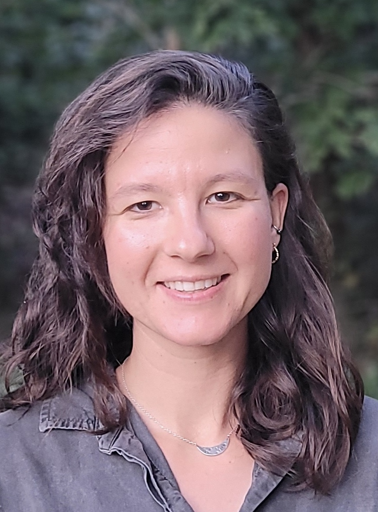

{width=200px style="border-radius: 50%;"}

PhD candidate at Nord University. My research aims to understand the mechanisms that create and maintain phenotypic diversity using Atlantic salmon as a model organism. 

## Research Interests

- Adaptive divergence and gene regulatory networks
- Genotype-to-phenotype mapping
- Phenotypic variation and life-history traits
- Decomposition ecology and saprotrophic fungi

## News

- **May 2026** Event Manager for [Pint of Science](https://pintofscienceno.wixsite.com/norway/pint26-program/bod%C3%B8) in Bodø
- **July 2026** Attending SMBE conference, Copenhagen
- **February 2025** Started PhD at Nord University

## Contact

rachel.l.carboni@nord.no
